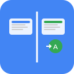

#  Split Translator

**A browser extension for Chrome and Edge that enables seamless side-by-side translation**

Split Translator is a browser extension for Chrome and Edge that enables seamless side-by-side translation of the current tab with a single click. The extension duplicates the active tab, arranges both windows without any visible gap, and automatically translates the right window using Google Translate.

## ✨ Key Features

- **One-Click Operation**: Instantly split the current tab and translate the right window with a single button.
- **Multi-Monitor Support**: Works correctly on secondary monitors and multi-display environments.
- **10 Languages Supported**: Japanese is the default, with support for nine additional major languages.


## 🎯 Functionality

All features are executed with a single button:

1. **Window Splitting**: Duplicates the current tab and arranges both windows side by side with no gap.
2. **Automatic Translation**: The right window is automatically translated using Google Translate.
3. **Language Selection**: The selected target language is saved automatically for future use.

## 🌍 Supported Languages

- Chinese (zh)
- English (en)
- French (fr)
- German (de)
- Italian (it)
- Japanese (ja) - **Default**
- Korean (ko)
- Portuguese (pt)
- Russian (ru)
- Spanish (es)

## 📦 Installation

### For Chrome

1. Navigate to `chrome://extensions/`
2. Enable "Developer mode" in the top right corner
3. Click "Load unpacked"
4. Select this project folder

### For Edge

1. Navigate to `edge://extensions/`
2. Enable "Developer mode" in the lower left corner
3. Click "Load unpacked"
4. Select this project folder

## 🚀 Usage

**Quick Start:** Only two steps are required:

1. **Select Language**: Click the extension icon and choose your target language
2. **Execute**: Click the "Split + Translate" button

→ The screen will be split side by side, and the right window will automatically display the translated page.

## 📁 Project Structure

```
split-translator/
├── manifest.json         # Extension configuration (Manifest V3)
├── popup.html            # UI (single-button design)
├── popup.js              # UI logic
├── background.js         # Main logic (Service Worker)
├── package.json          # Project metadata
├── LICENSE               # MIT License
├── PRIVACY_POLICY.md     # Privacy policy for Chrome Web Store
├── README.md             # Project documentation
├── split-translator-demo.gif  # Demo animation
└── icons/                # Icon files (multiple sizes)
    ├── icon.png          # Original icon
    ├── icon-16.png       # 16×16px (toolbar)
    ├── icon-32.png       # 32×32px (Windows)
    ├── icon-48.png       # 48×48px (extension management)
    └── icon-128.png      # 128×128px (Chrome Web Store)
```

## 🔧 Technical Details

### Required Permissions
```json
{
  "permissions": [
    "tabs",          // Tab operations
    "storage",       // Save settings
    "system.display" // Multi-monitor support
  ],
  "host_permissions": [
    "https://translate.google.com/*"
  ]
}
```

### Core Technologies
- **Window API**: Precise window splitting using `chrome.windows`
- **Google Translate**: Reliable web page translation
- **Storage API**: Persistent language settings
- **Display API**: Multi-monitor detection

## ⚠️ Notes and Limitations

| Item | Details |
|------|---------|
| **Restricted Sites** | Does not work on `chrome://`, `edge://`, or other internal pages |
| **Translation Dependency** | Relies on Google Translate (not available offline) |
| **Popup Blockers** | Please allow popups in your browser settings |
| **Screen Resolution** | Minimum width of 800px is recommended |
| **Browser Version** | Chrome 88+, Edge 88+ (Manifest V3 required) |

## 🛠️ Development & Customization

### Adjusting Window Overlap
```javascript
const OVERLAP_PIXELS = 8; // Adjustable in background.js
```

### Adding a Language
```html
<!-- Add to the <select> element in popup.html -->
<option value="new_language_code">🏁 New Language Name</option>
```

### Timeout Setting
```javascript
await waitForTabReady(tabId, 3000); // 3 seconds timeout
```

## 📄 License

**MIT License** – Free for personal and commercial use.
